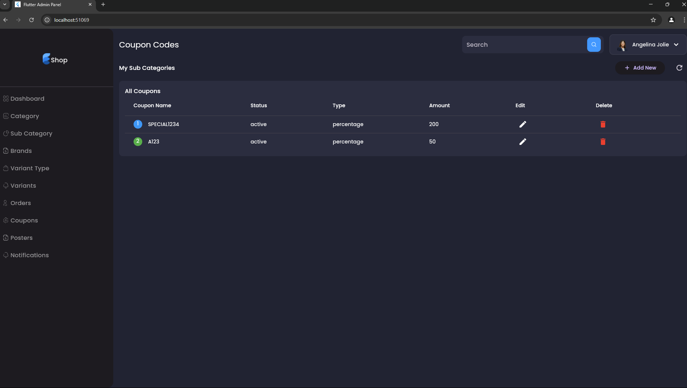

<div align="center">
  
  # 🌟 Full Stack E-commerce Platform 🌟
  
  <p align="center">
    
  </p>

  [](https://flutter.dev)
  [](https://nodejs.org)
  [](https://www.mongodb.com)
  [](https://stripe.com)

  <p align="center">🚀 A modern, feature-rich e-commerce solution with powerful admin panel and sleek customer mobile application</p>
</div>

---

## 📱 Admin Panel Features

<div align="center">
  <table>
    <tr>
      <td></td>
      <td></td>
      <td></td>
    </tr>
    <tr>
      <td align="center"><b>Admin Panel Overview</b></td>
      <td align="center"><b>Dashboard Analytics</b></td>
      <td align="center"><b>Order Management</b></td>
    </tr>
  </table>
</div>

## 🎯 Core Features

<table>
  <tr>
    <td>
      <h3>📊 Product Management</h3>
      
      <ul>
        <li>🏷️ Category Management</li>
        <li>📦 Product Organization</li>
        <li>🔍 Advanced Filtering</li>
        <li>📈 Stock Tracking</li>
      </ul>
    </td>
    <td>
      <h3>🎨 Marketing Tools</h3>
      
      <ul>
        <li>🖼️ Poster Management</li>
        <li>🎯 Promotional Campaigns</li>
        <li>📢 Marketing Tools</li>
        <li>🎨 Banner Design</li>
      </ul>
    </td>
  </tr>
</table>

## 💫 Advanced Features

<div align="center">
  <table>
    <tr>
      <td width="33%">
        
        <h4>📨 Notifications</h4>
        <p>Push notification system</p>
      </td>
      <td width="33%">
        
        <h4>🏷️ Coupon Management</h4>
        <p>Discount and offers</p>
      </td>
      <td width="33%">
        
        <h4>🏢 Brand Management</h4>
        <p>Brand organization</p>
      </td>
    </tr>
  </table>
</div>

## 🛠️ Category Management

<div align="center">
  <table>
    <tr>
      <td></td>
      <td></td>
    </tr>
    <tr>
      <td align="center"><b>Main Categories</b></td>
      <td align="center"><b>Sub Categories</b></td>
    </tr>
  </table>
</div>

## 🚀 Features Overview

### 👨‍💼 Admin Dashboard
- **Analytics & Reporting**
  - Real-time sales tracking
  - Inventory management
  - User analytics
  - Revenue reports

- **Product Management**
  - Category organization
  - Brand management
  - Stock control
  - Variant management

- **Marketing Tools**
  - Push notifications
  - Promotional posters
  - Coupon management
  - Campaign tracking

### 🛍️ E-commerce Features
- Secure authentication
- Product categorization
- Shopping cart
- Order management
- Payment integration
- Push notifications

## 🛠️ Technology Stack

<table>
  <tr>
    <td>
      <h4>Frontend</h4>
      <ul>
        <li>Flutter SDK</li>
        <li>GetX State Management</li>
        <li>Custom UI Components</li>
      </ul>
    </td>
    <td>
      <h4>Backend</h4>
      <ul>
        <li>Node.js + Express</li>
        <li>MongoDB Atlas</li>
        <li>JWT Authentication</li>
      </ul>
    </td>
    <td>
      <h4>Services</h4>
      <ul>
        <li>OneSignal Push</li>
        <li>Stripe Payments</li>
        <li>RazorPay Integration</li>
      </ul>
    </td>
  </tr>
</table>

## 🚀 Getting Started

### Prerequisites
- Flutter SDK
- Node.js
- MongoDB
- Git

### Environment Setup
```bash
# Clone repository
git clone [repository-url]

# Install dependencies
cd ecommerce-platform
flutter pub get
cd server && npm install
```

### Configuration
```env
# server/.env
PORT=3000
MONGO_URL=your_mongodb_url
STRIPE_PBLK_KET_TST=your_stripe_public_key
STRIPE_SKRT_KET_TST=your_stripe_secret_key
RAZORPAY_KEY_TEST=your_razorpay_key
ONE_SIGNAL_APP_ID=your_onesignal_app_id
ONE_SIGNAL_REST_API_KEY=your_onesignal_api_key
```

### Running Applications
```bash
# Start Backend
cd server_side/online_store_api
npm start

# Launch Admin Panel
cd client_side/admin_panel_startup
flutter run

# Launch Customer App
cd client_side/flutter_ecommerce_start
flutter run
```

## 🔐 Security Features
- JWT Authentication
- Data Encryption
- Secure Payments
- Input Validation
- Rate Limiting

## 🌟 Coming Soon
- Dark Mode
- Multi-language Support
- AR Product Preview
- AI Recommendations
- Voice Search

<div align="center">
  <br>
  <p>
    <a href="https://github.com/yourusername/ecommerce-platform/issues">Report Bug</a>
    ·
    <a href="https://github.com/yourusername/ecommerce-platform/issues">Request Feature</a>
  </p>
  <p>If you love this project, please consider giving it a ⭐</p>
  
</div>
  <p align="center">
    
    
    
  </p>